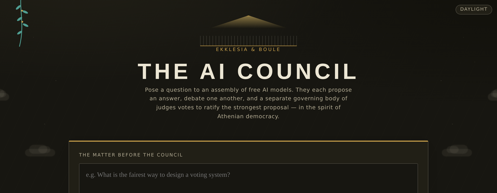
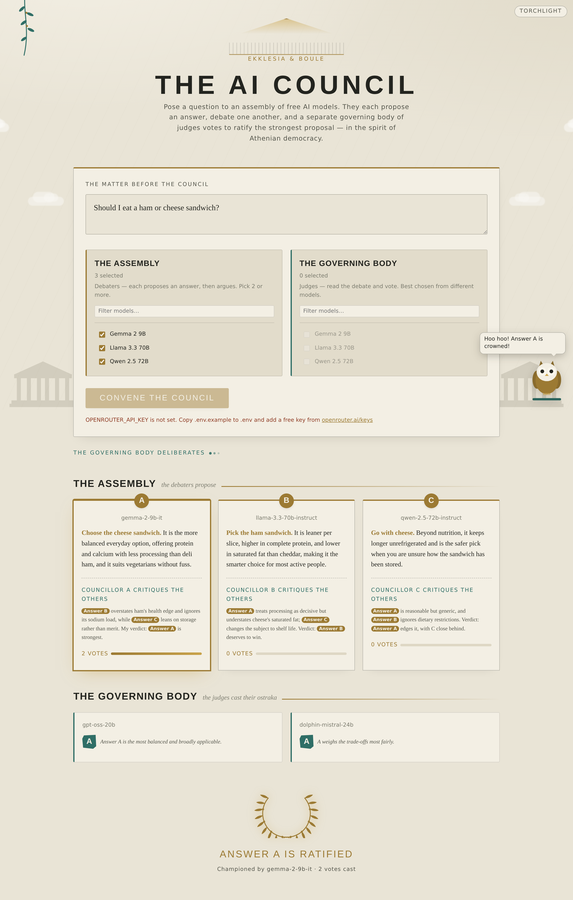
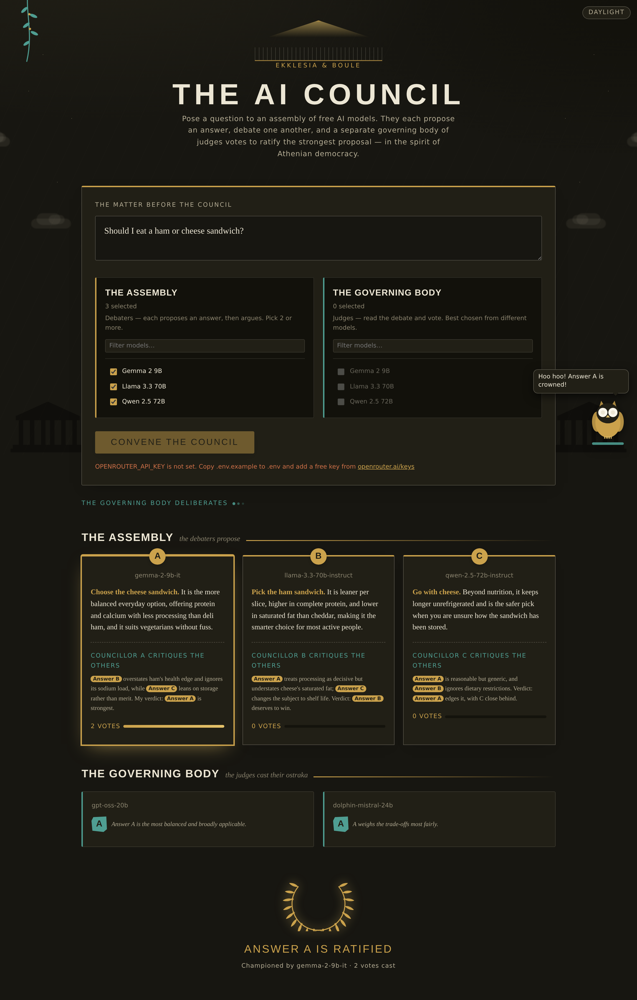
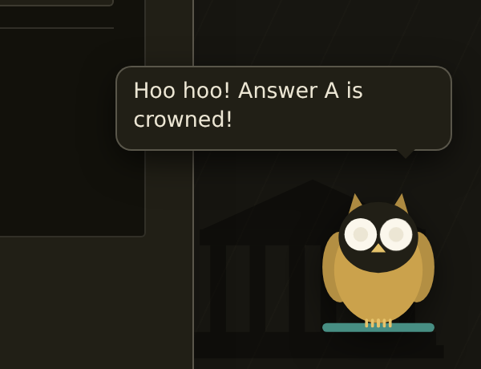
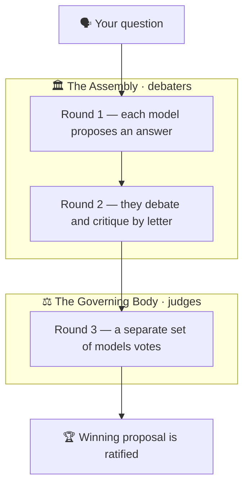

<div align="center">

# 🏛️ The AI Council

**An assembly of free AI models that deliberate like an Athenian democracy.**

Pose a question. A chamber of AI models each proposes an answer and debates the others; a
separate governing body of *different* models then votes to ratify the strongest proposal —
all in a live web interface themed as an Athenian agora.

[](LICENSE)
[](https://www.python.org/)
[](https://fastapi.tiangolo.com/)
[](https://openrouter.ai/)
[](https://github.com/syk-v1/Agent-project-/actions/workflows/ci.yml)
[](static/)



</div>

---

## ✨ Why AI Council

Most "ask an AI" tools give you a single answer from a single model. The AI Council instead
convenes **several free models** and makes them *argue*: they each commit to a position,
critique each other's reasoning, and a panel of impartial judge models decides the winner.
You get a considered verdict rather than one model's first guess — and because every model
runs in **OpenRouter's free cloud tier**, it costs nothing and asks nothing of your machine.

## 🔑 Features

- **🆓 Free models only** — uses OpenRouter's free tier and auto-discovers every model that
  costs nothing to run, so the roster is always current.
- **💻 Zero load on your device** — all inference happens in the cloud; your machine only
  runs a tiny Python web server. No GPU, no local models, no downloads.
- **⚖️ Two-chamber deliberation** — an **Assembly** of debaters proposes and argues; a
  **separate** Governing Body of different models votes, so nobody judges their own answer.
- **📡 Live proceedings** — proposals, debate, and votes stream into the page in real time
  over Server-Sent Events, with no page reloads.
- **🏛️ Athenian theme** — marble & bronze design in light *"midday"* and dark *"torchlight"*
  themes, animated stelae, ostraka voting shards, and a laurel crown for the winner.
- **🦉 The Owl of Athena** — a companion mascot that watches the debate and celebrates the
  verdict.
- **🛡️ Rate-limit resilient** — honors `Retry-After`, backs off with jitter, and drops a
  throttled model without crashing the council.
- **🧪 Tested & dependency-light** — offline tests need no API key; the frontend has no build
  step and no CDN, so it works fully offline once running.

## 📸 Screenshots

| Light · *"marble at midday"* | Dark · *"council by torchlight"* |
| :---: | :---: |
|  |  |

<div align="center">

</div>

## 🏛️ How it works

The models are split into two chambers, and the process runs in three rounds:

| Round | Chamber | What happens |
|------:|---------|--------------|
| 1 · **Propose** | The Assembly *(Ekklesia)* | Each debater model answers the question independently, committing to a clear position. |
| 2 · **Debate**  | The Assembly | Answers are shown anonymously (A, B, C…); each debater critiques the **others** by letter and argues who should win. |
| 3 · **Ratify**  | The Governing Body *(Boule)* | A **separate** set of judge models reads the answers + debate and each casts one vote. The most-voted answer is ratified. |

Using different models as judges means no one votes for their own answer; answers are
anonymised so votes follow the argument, not the name; and ties break deterministically.



## 🚀 Quickstart

You need **Python 3.10+** and a free OpenRouter API key (sign-up is free at
[openrouter.ai/keys](https://openrouter.ai/keys)).

<details open>
<summary><b>Windows (PowerShell)</b></summary>

```powershell
git clone https://github.com/syk-v1/Agent-project-.git
cd Agent-project-
python -m pip install -r requirements.txt
Copy-Item .env.example .env
notepad .env      # paste your key after OPENROUTER_API_KEY=
python -m uvicorn app.main:app --reload
```

</details>

<details>
<summary><b>macOS / Linux</b></summary>

```bash
git clone https://github.com/syk-v1/Agent-project-.git
cd Agent-project-
python3 -m pip install -r requirements.txt
cp .env.example .env
$EDITOR .env      # paste your key after OPENROUTER_API_KEY=
python3 -m uvicorn app.main:app --reload
```

</details>

Then open **<http://localhost:8000>**, pick a few models for each chamber, type a question,
and click **Convene the Council**. Watch the proposals rise, the debate unfold, the judges
cast their ostraka, and a winner get crowned.

> [!TIP]
> Free models share per-minute and daily rate limits. The app caps concurrent calls and
> retries when throttled, but keeping each chamber to ~2–3 models keeps things smooth.

## ⚙️ Configuration

Settings live in `.env` (copy from `.env.example`):

| Variable | Default | Purpose |
|----------|---------|---------|
| `OPENROUTER_API_KEY` | *(required)* | Your free OpenRouter key. |
| `OPENROUTER_MAX_CONCURRENCY` | `2` | Max simultaneous calls to OpenRouter (lower = fewer rate-limit errors). |
| `OPENROUTER_TIMEOUT` | `90` | Per-request timeout, in seconds. |
| `OPENROUTER_APP_URL` | `http://localhost:8000` | Optional attribution sent to OpenRouter. |
| `OPENROUTER_APP_TITLE` | `AI Council` | Optional attribution sent to OpenRouter. |

## 🗂️ Project structure

```
app/
  main.py        FastAPI app: serves the page, lists models, streams the council (SSE)
  council.py     The two-chamber process: propose → debate → vote → ratify
  openrouter.py  Async OpenRouter client (retry/backoff + concurrency cap + model catalog)
  prompts.py     Prompt templates for each round and role
  config.py      Loads settings from .env
static/
  index.html     The agora
  style.css      Athenian theme (light/dark) + animations, side scene, owl
  app.js         Roster pickers, live SSE streaming, markdown rendering, owl controller
tests/
  test_council.py  Offline tests of the orchestration (no API key, no network)
docs/            Screenshots used in this README
```

## 🧪 Testing

The orchestration is covered by offline tests that use a stub in place of OpenRouter, so
they need **no API key and make no network calls**:

```bash
python -m pytest
```

They verify that answers are anonymised, that only governing models vote, that votes tally
correctly, that a failing debater is dropped without crashing the council, and that ties
resolve deterministically.

## 🧰 Tech stack

**Backend:** Python · [FastAPI](https://fastapi.tiangolo.com/) · Uvicorn ·
[httpx](https://www.python-httpx.org/) (async) &nbsp;·&nbsp;
**Frontend:** vanilla HTML / CSS / JavaScript — no framework, no build step, no CDN &nbsp;·&nbsp;
**Models:** [OpenRouter](https://openrouter.ai/) free tier &nbsp;·&nbsp;
**Tests:** pytest

## 🗺️ Roadmap

- [ ] Multi-round debate (a rebuttal pass)
- [ ] A "chief archon" that synthesises the top answers instead of a raw vote
- [ ] A saved "hall of records" of past councils

## 📜 License

Released under the [MIT License](LICENSE).

<div align="center">
<sub>Built in the spirit of Athenian democracy 🏛️ — deliberation over decree.</sub>
</div>
